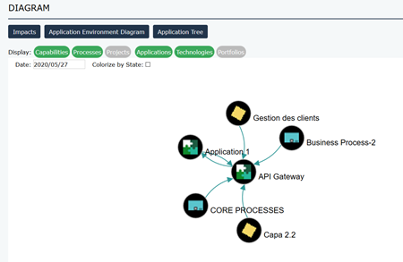
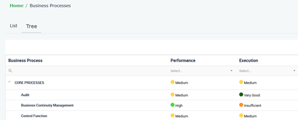

{}
All general information you need to know about HOPEX 360
{}

## Technical limitations
### HOPEX Version V5 CP1
This website template is qualified against the HOPEX V3 version.

### Web browser Version
This website template is qualified against the following web browser:
* Firefox 75 and above
* Chrome 81 and above

### Resolution
This website is optimised for a 1920 x 1080

### Licensing
It only considers the scope of the ITPM and ITBM licence.

### Deployment
Once generated, the static website needs to be hosted on an IIS webserver to enable all the functionalities.
The functionalities that require IIS include but are not limited to:
*	Application Force Diagram

*	Capabilities and Process Tree List

### Languages
The website structure is available in both English and French. The translations can be amended using the _Code Templates referenced in the descriptors.
The website will be generated in the language set on the user running the web generation.
The translation of the content itself relies on the available languages of HOPEX.

### Data scope
HOPEX360 covers the following data. For more details, refer to the tables at the end of the document.

## Homepage
### Overview

### Client specific
####	Description
The 4 tiles down the tiles will not point anywhere. It is up to the consultant and/or the client to update the links in the Homepage descriptor.
The purpose of these links is to point to:
-	Client specific charter: online document
-	Missing content: email to a dedicated email address
-	Governance Process: online document
-	Provide feedback: email to a dedicated email address
####	Customisation
To modify:
-	Open the “HOPEX EA_General Menu” Descriptor
-	Open the “Bottom Tiles” text
-	Add a link within the <h6> tag:
o	Client specific charter: line 47
o	Missing content: line 92
o	Governance Process: line 145
o	Provide feedback: line 188

###	Site Map
The top menu allows to navigate through the pages.
Here is a breakdown of the navigation:

**Navigation menu**| | |**Associated Object**
:-----:|:-----:|:-----:|:-----:
Business|Capability|Capabilities Tree list: searchable hierarchical list|Business Capability Maps
 | |Capabilities list: alphabetically sorted flat list|Business Capabilities
 |Process|Processes Tree list: searchable hierarchical list|Business Processes
 | |Processes list: alphabetically sorted flat list|
Information|Dictionary|Concepts list: alphabetically sorted flat list|Concept
Application|Portfolios|App portfolios list: alphabetically sorted flat list  |Portfolio typed as Application
 |Applications|Applications list: alphabetically sorted flat list  |Application
 |Projects|Projects list: alphabetically sorted flat list  |Project
Technology|Portfolios|Tech portfolios list: alphabetically sorted flat list  |Portfolio typed as Technology
 |Technologies|Technologies list: alphabetically sorted flat list  |Technology
 |Vendor|Vendors list: alphabetically sorted flat list  |Org Unit typed Vendor
CIO Dashboard| |Main dashboard|Specific report page
 | |Technology Obsolescence|Specific report page
 | |Strategic Planning|Specific report page
 | |Rationalization|Specific report page
 | |Reports list: alphabetically sorted flat list  |Specific report page
Search | |Pop up to type in key words|Results shown in table

##	List index
TEST FCR 16/12/21
##	Tree list index

##	Search
The search is implemented by the Fusejs library (https://fusejs.io/)
